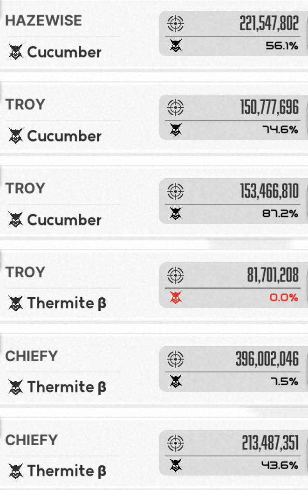

# UnionAttackLogScanner

I started this as just a personal tool, but when I saw how helpful it could be, I thought, "Why not make it even easier for everyone else and save them from all that spreadsheet work?" So, here we are.<br>
As this project is still early in its development, checkout the [development roadmap](#development) for future improvments and development for this project.

## Introduction

UnionAttackLogScanner is tool that aims remove tediouse spreadsheet work for tracking union member damage in a specific game. simple drag in screenshots of damage logs, and click submit, the application will take care of the rest and present you with a bar chart and notify you of any slackers.
<br>

## Getting Started

To get started, clone this repo onto your machine and open your terminal with the root directory pointed to this repo and type:

```bash
npm install
```

then type in

```bash
npm run dev
```

On your browser, localhost:8080 should appear, and you are now running our application!<br>Next you would take screenshots of the union damage logs.

Below is a example of the image: **(make sure the image is cropped just like below!)** <br>
<br>

After, go to the website and click 'Get Started'.</br>

Click 'choose file' and select your images, then click 'Submit'. **Scan might take longer if you have more images**.</br>
**It is recommended to submit only 1 day worth of logs for the best result.**</br>
Next, you will see a list of possible names appear with 2 button for each name.</br>

- Add: You will click the button if the name is scanned correctly.
- Change: you will click this button if the name is misspelt, a popup will appear asking you to input the correct name.</br>

**You will still need to change the misspelt name even if the correct name has already been added before**</br>
Any members that didn't attack could be added manually using the input on the left.</br>
When every name has been added click 'Save & Finalize'.

## Limitation

This application relies on <a href='https://github.com/naptha/tesseract.js/tree/master'>tesseract.js</a> OCR Engine, to scane each image to extract the words. Here is a list of constraints and deficiencies:
| constraints | Status | Notes |
| :--------------------: | :----: | :---- |
| OCR Engine | ❌ | The OCR engine has diffuclties picking up information at the top and bottom of the image, this leads into inconsistent result being presented, this should be taken into account and manual double check should be performed before making any decisions.
| Language limitation | ⏳ | At the moment, this application exclusively supports English names. While it might be feasible to extend its functionality to other languages, further testing is necessary to ensure the reliability of tesseract.js in handling these variations.
| Inconsistant names | ❌ | Tesseract.js could be inconsistant ocationally, for example the name 'mimi' could result in both 'mimi' or 'miimi' being scanned. **If you see any names in the members list missing or damage being off on this bar chart, you might need to check the result of tesseract.js scan result and see if the name is being miss read** more [Troubleshoot](#Troubleshoot) below on how to configure this problem.
| Inconsistant damage | ❌ | As mentioned above, Tesseract.js could be inconsistant ocationally, some damage numbers might be off for exsample '1' could result in '7' or '5' => '3' <br>**So please take this into consideration when making a final dicision.** But the overall performance should be fairly accurate.

- ❌ = **Problem!**
- ⏳ = **Problem with solution!**

## Development

|                   Goal                   | Status | Notes                                               |
| :--------------------------------------: | :----: | :-------------------------------------------------- |
|          Typescript conversion           |   🎉   |                                                     |
|       create a member list on app        |   🎉   |                                                     |
| Add and remove images in the application |   🎉   | ~~Exploring possible options.~~ **solution found!** |
|    move scanning function to backend     |   🎉   |                                                     |
|     ease the troubleshooting process     |   🎉   | **Solution implemented!**                           |
|           Frontend improvement           |   🎉   |

- 🎉 = **Completed!**
- ⏳ = **In progress!**
- ⏰ - **Waitlist!**
